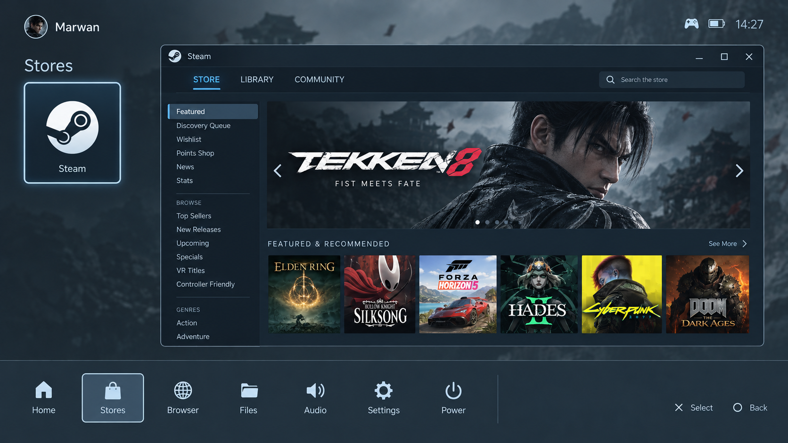

# ADR 0008 — Steam inside a controller-operated Stores pane

**Status:** Experimental implementation — enabled and remotely tested on PC1's
Xorg bench. Physical display/controller acceptance remains open.
**Originally proposed:** 2026-08-08
**Revisited:** 2026-10-09, following the owner's request and layout reference.
**Relates to:** [ADR 0013: NVIDIA Xorg](0013-nvidia-xorg-display.md),
[ADR 0011: native Steam](0011-steam-baked-in-not-sandboxed.md),
[controller routing](../controller-routing.md), and the historical Stores layout
in [ADR 0006](0006-shell-skeleton.md).

## Proposed experience

A Stores section keeps MarwanOS navigation visible, with a store selector on the
left and the running Steam client in a large pane on the right. The owner supplied
this reference on October 9:

The reference establishes the arrangement. The controller version uses Steam's
native Big Picture/gamepad UI within the pane; its contents will differ from the
desktop Steam layout pictured. Desktop title-bar buttons are replaced by
controller actions in MarwanOS. The current shell's visual theme remains the
basis for its surrounding controls.

The intended behavior is:

- Open Stores, select Steam, and enter the live client without losing the
  surrounding navigation. Selection and input focus have distinct visible states.
- Browse, sign in, search, manage downloads, and use Steam with the controller.
  Reuse the installed client's account and session.
- Return to the store selector or another MarwanOS section through the reserved
  Home controls. Returning to Steam restores the same client and browsing state.
- Launch games fullscreen. Returning from a game restores Stores and its Steam
  pane. Only the store client is embedded; games remain ordinary applications.

The source now implements Stores, native Steam hosting, controller ownership and
game handoff/return. The [October 9 bench report](../steam-embedding-20261009.md)
records live screenshots, passing checks and remaining acceptance work.
Embedding is opt-in; it requires the explicit Xorg backend and host capability.
The existing fullscreen Steam library entry remains available.

## What changed since August

| Earlier assumption | Current evidence and implication |
| --- | --- |
| PC1 uses direct gamescope, which owns sibling fullscreen clients | ADR 0013 selects accelerated Xorg/Openbox/xcompmgr on connected NVIDIA displays. PC1 has owner-confirmed stable Steam output at 3440×1440 / 174.96 Hz. A native X11 child window is now worth testing. |
| Every solution needs this project's first GDExtension | Mowser already supplies an offscreen CEF browser as a Godot Control. Native extension build infrastructure exists. This does not make it capable of embedding Steam. |
| Steam runs as a Flatpak | ADR 0011 ships native Steam. `steamctl` starts Big Picture with `-gamepadui` and supports the legacy installation where needed. |
| The shell must invent controller forwarding | The existing broker exclusively reads physical pads, supplies virtual application pads, reserves Guide/Share, and neutralizes application input while the shell owns it. Ownership must be extended to embedded Steam. |

The [October 7 investigation](../steam-display-corruption-20261007.md) supports
fullscreen Steam and observed Silksong menu controls on PC1. It does not establish
embedding, popup behavior, or performance with both interfaces visible. Other
GPUs still use gamescope; this proposal initially targets the explicit Xorg
backend, not every system reporting Godot's `X11` display server.

## Recommended first route: a native X11 pane

Test reparenting the actual Steam content window into an X11 host aligned with a
Godot pane. Steam keeps rendering through its own accelerated client, while
MarwanOS draws the surrounding interface. This route does not require copying
Steam frames into a Godot texture or changing the shell's Vulkan renderer.
Both render together on PC1 in the recorded bench screenshots. Motion and frame
pacing still require physical acceptance.

[Xlib](https://xorg.freedesktop.org/archive/current/doc/libX11/libX11/libX11.html#Changing_the_Parent_of_a_Window)
provides `XReparentWindow`. This is a window-management mechanism, not proof that
Steam supports embedding. [XEmbed](https://specifications.freedesktop.org/xembed/latest/lifecycle.html)
adds a cooperative protocol, including `_XEMBED_INFO` and focus messages; Steam's
participation has not been established. Do not label simple reparenting a working
XEmbed implementation.

The implemented host is a separate Python/Xlib process. Steam is a native child
of its rectangular host window, which is an override-redirect sibling aligned to
the Godot pane. This protects Steam from Godot recreating its own window. The
host owns the X save set and records original client attributes for crash recovery.
Godot sends geometry, visibility and focus requests through private atomic JSON
files with a short lease. This uses native reparenting, without XEmbed, CEF,
screenshots, texture transport or an additional compositor.

The host design must cover:

1. **Window selection.** Attach only the verified Steam UI for the current player
   session. Inspect client properties, process ownership/ancestry and transient
   relationships together. Steam can already be running and its UI can belong to
   `steamwebhelper`, so neither a launcher PID nor a title substring suffices.
   Never embed a game's window. Observe window replacement rather than retaining
   an XID after destruction.
2. **Window-manager agreement.** Coordinate withdrawal from Openbox before
   attaching the client, and restore normal management when detaching. Record
   original state and geometry. The shipped Openbox rule maximizes every app;
   fullscreen requests and remapping must not enlarge Steam over the whole shell.
   Do not reparent Openbox's decoration/frame as though it were Steam's client.
3. **Geometry and visibility.** Follow the pane's actual physical pixel rectangle
   as the Godot viewport, scale and display change. Initially use a rectangular
   native pane. Measure Big Picture's minimum size, aspect handling and text
   scaling at the reduced pane size, including 1080p and PC1's ultrawide display;
   the screenshot does not establish that its desktop layout fits the gamepad UI.
   Godot's rounded clipping, shaders and CanvasItem ordering do not
   automatically apply to a foreign window. Hide the native surface before
   drawing shell dialogs over that area; verify the hidden client keeps its state.
4. **Popups and text entry.** Inventory Steam's login, search, menus, notifications,
   keyboard, Friends and checkout surfaces. Keep required dialogs usable, prevent
   unrelated windows taking over the shell, and prove keyboard focus lands in the
   intended Steam field. Steam's own controller keyboard may suffice; if it does
   not, integrate the existing shell keyboard with verified native input focus.
5. **Lifetime and recovery.** Detach before planned parent destruction or native
   handle changes. `Kiosk.set_overlay()` currently changes `transparent_bg`, and
   `Kiosk.focus_shell()` explicitly accounts for Godot recreating its X window.
   The host must survive that transition without destroying Steam's UI.

Xlib's [save-set mechanism](https://xorg.freedesktop.org/archive/current/doc/libX11/libX11/libX11.html#Controlling_the_Lifetime_of_a_Window)
can protect foreign windows when the embedding X connection closes. Its
connection ownership matters: a save set on an unrelated helper connection does
not establish protection against Godot destroying the parent. Explicit parent
destruction also needs a lifecycle solution. Prove orderly detachment and crash
recovery with a disposable client before attaching the real Steam session. Do
not select a helper/extension split until these cases are resolved.

## Controller ownership

Use one explicit foreground owner. The broker's application-input switch is
session-wide, not a per-process permission; X keyboard focus alone cannot keep
Steam and a running game from reading the same virtual controller.

| Owner | Application-pad output | Shell behavior |
| --- | --- | --- |
| Stores navigation | Neutral | D-pad/stick selects stores or OS navigation; Cross/A enters Steam; Circle/B returns from Stores. |
| Steam pane | Enabled only after the pane is visible and focused, with no game active | Steam handles ordinary buttons, sticks and shoulders. Shell focus traversal and held-input polling are suspended. Circle/B remains Steam's own Back. |
| MarwanOS menu or keyboard | Neutral before opening the shell surface | Guide/PS returns from Steam to the Stores selector. Within Steam, Share/View opens Steam's native menu; outside the pane it retains existing Home behavior. |
| Fullscreen game | Enabled only for the established foreground game | Steam's pane and shell navigation are hidden/inactive; existing game Home/menu handling remains available. |

Entering Steam must suppress the Cross/A press and any held directions until
released. Returning to shell navigation must not turn the same held control into
a second selection. Reuse broker neutralization, held-control suppression and
lease expiry rather than adding another physical-controller reader. Suppress
Godot focus navigation, repeat timers and polling consumers while Steam owns the
pad; marking a single event handled is insufficient.

Guide/Share must work even when the embedded client has X keyboard focus and no
ordinary `Launcher` launch is active. `shell_root.gd` currently requires
`Launcher.is_busy()` and `can_close()` before opening its app menu, so embedding
needs an explicit contextual Home path. Shoulder buttons belong to Steam while
inside the pane; they must not simultaneously switch stores.

If another game is still running or owns the foreground, keep Steam's application
input disabled and offer Resume/Close through the existing game flow. Test for
background Steam also consuming input during a game. If Steam's own focus handling
does not prevent that, the current session-wide broker switch alone is not enough.

## Client and game lifecycle

Keep one Steam client session and track its embedded surface separately from a
fullscreen game launch. Opening Stores must reuse an existing client; closing
Stores backgrounds its UI rather than calling `steamctl stop`. Explicit Close
Steam remains a separate operation with its existing game implications.

The implementation adds a deliberate Launcher integration. Its existing `launch_started`
consumers hide the shell, `_app_is_up()` may yield the whole screen, and closing a
Steam handoff invokes `steamctl stop`. Those behaviors cannot be reused unchanged
for entering or leaving the pane. All calls to `ControllerRouter.set_app_input`
must agree with the same foreground owner; a later Launcher callback must not
undo the Stores focus decision.

For a game launched from either the MarwanOS library or Steam's own library:

1. Neutralize input during the transition and hide the embedded Steam surface.
2. Establish the actual game window and app identity before giving it fullscreen
   focus and input. Steam may launch it internally without a shell-spawned game
   PID; a newly active window alone is not evidence of a game.
3. Follow game exit and minimize/resume independently from Steam's lifetime.
   Return to the saved Stores surface when the game ends, or offer Resume if it
   remains running. A crash must not leave a dead pane covering the shell.
4. Count play time for the identified foreground game only. Steam browsing,
   downloads, menus and its client window must never count as gameplay. Preserve
   the existing exact `STEAM_GAME` app-ID check for Steam handoffs.

Automatic fullscreen handoff and return from a game started inside Steam are
required for the proposed experience. Until that is verified, a pane-only demo
must be reported as partial, even if browsing works.

## Other routes

| Route | Role in the revised proposal |
| --- | --- |
| Native X11 child window | First candidate on PC1's Xorg backend. Prove client behavior, lifetime and focus before building the full Stores screen. |
| Positioned sibling window framed by the shell | Possible diagnostic comparison if parenting fails. It is not true embedding; stacking, clipping and dialogs still need work. It does not pass the pane contract by merely looking correct in one screenshot. |
| XComposite capture into a Godot texture | Consider only if native composition cannot meet the required layering. GPU-buffer import, synchronization and input remain new work. Avoid adopting a per-frame CPU screenshot loop or switching renderers as an unmeasured solution. |
| Nested compositor with capture | Retained from August as a separate experiment if simpler routes fail. Extra composition, GPU-buffer transport and input routing require measurements. Success on Xorg would not establish support on the gamescope backend. |
| Steam website in Mowser | Available architecture for a separate web-store experience, but it does not meet this proposal's actual-client requirement. Browser authentication and client install/launch handoff would be separate work. |

## Prototype sequence and acceptance

Use a development harness and opt-in feature flag, off by default. Reuse the
player session's actual DISPLAY, Xauthority, D-Bus environment and groups. Retain
Steam GPU acceleration, sandboxing, and PC1's accepted display configuration.
No display-driver or session-backend change is needed for this experiment.

1. **Resolve native-host lifetime first.** Use the pinned Godot build, Xorg,
   Openbox rules and a disposable native client. Verify attach, resize, detach,
   dialogs, parent replacement and abrupt host exit. Xvfb/Mesa may establish
   lifecycle mechanics but cannot certify NVIDIA presentation.
2. **Test the installed Steam client.** Start/reuse Big Picture through the
   existing native contract. Record its actual window tree/properties, ownership,
   size hints, remapping, popups and input behavior in a minimal pane. Decide
   whether native parenting is viable before building the Stores product UI.
3. **Build the reference arrangement with controller ownership.** Restore Stores,
   its selector, visible OS navigation and contextual Home path. Exercise account
   state, search/text entry, browsing, tab changes and downloads. No purchase is
   necessary to test checkout navigation or dialogs.
4. **Prove game handoff and recovery.** Launch from both libraries, return after
   game exit, minimize/resume, replace/restart the Steam window, and exercise
   offline and failure paths. Then perform physical PC1 display/controller
   acceptance before proposing a default-enabled release.

| Gate | Required evidence |
| --- | --- |
| Pane composition | Actual Steam animation/video remains inside the pane, navigation remains visible, resize works, and login/modal surfaces are usable. No fullscreen escape or stale duplicate client surface. |
| Controller use | Complete store entry, navigation, search, Back, Home, return to tabs and re-entry without mouse/keyboard. No double navigation or held-button leakage; disconnect/reconnect and Guide/Share remain usable. |
| Game handoff | A game started from each library becomes fullscreen, accepts input, and returns to the saved Steam pane on exit. Menus/minimize/resume do not drive Steam and the game together. |
| Lifetime | Repeated hide/show and parent replacement preserve the Steam session. Disposable-client crash tests pass before real-client trials. Steam/host failure leaves working MarwanOS navigation and an explicit fullscreen/retry action. |
| Display/performance | On physical PC1 at 3440×1440 / 174.96 Hz, compare fullscreen and embedded Steam using the same workload: frame pacing, CPU/GPU use, memory, and input response. Record physical motion observations; a clean compositor screenshot alone is insufficient. |
| State/history | Account and downloads survive leaving Stores; game time is attributed only to the actual foreground game. Steam's startup wrapper exiting is not treated as the client exiting. |
| Backend boundary | Explicitly require `MARWANOS_COMPOSITOR=x11` plus available host capability. Unsupported backends retain the current fullscreen launch. Missing/failed embedding never removes that route. |

Record results with build/client/driver versions, window properties and physical
observations. An unresolved gate leaves native embedding experimental and the
fullscreen launcher usable. Failure of the first route triggers a documented
comparison of alternatives, not an assumption that another capture path works.

## Expected implementation touchpoints

- New Stores seam/screen and native host; a small development fixture and
  image/export packaging for the host extension.
- `shell_root.gd` for persistent navigation, Stores entry and contextual Home;
  `launcher.gd` for the separate client/game lifecycle and input ownership.
- `kiosk.gd` for native focus, parent changes and overlay ordering;
  `controller_router.gd` for a single coordinated input owner. Change broker
  policy only if the prototype proves its existing contract insufficient.
- `steamctl` only where an explicit UI/background operation is actually needed;
  preserve native discovery/launch/shutdown. Scope any Openbox adjustment to the
  embedded client or host rather than changing every app's window policy.

The August proposal recommended nested gamescope capture under the then-current
direct-gamescope/Flatpak architecture. That recommendation is superseded for the
PC1 Xorg investigation. It remains historical context, not evidence that either
capture or native embedding has passed all acceptance gates. The October 9
implementation establishes the core bench flow; the linked report distinguishes
remote verification from remaining physical and compatibility acceptance.
