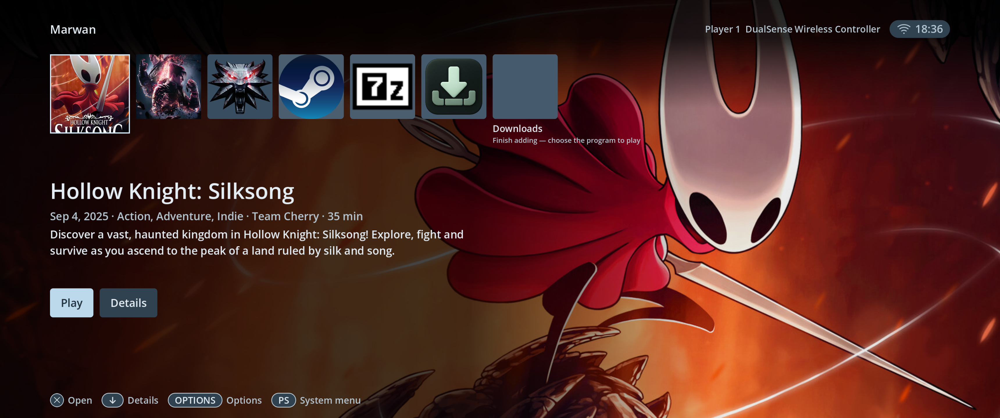
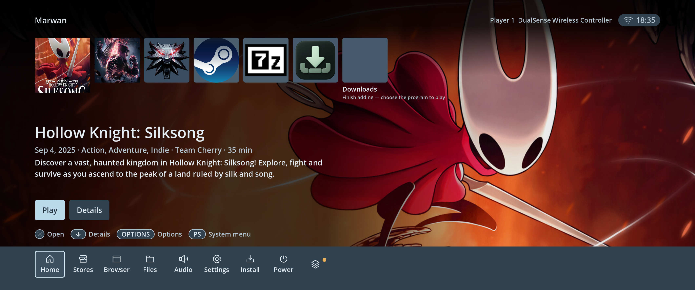
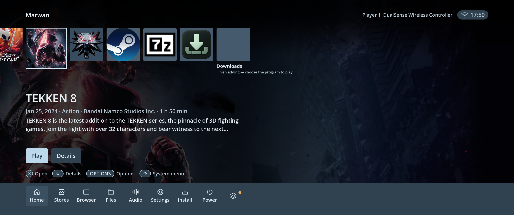
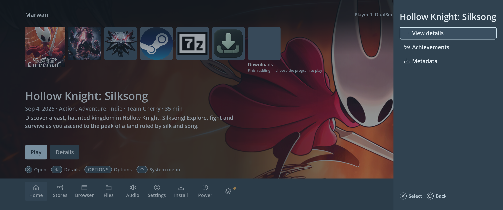
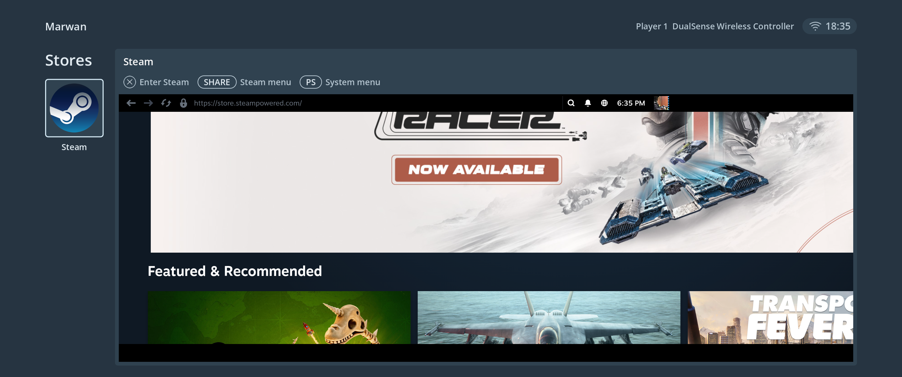
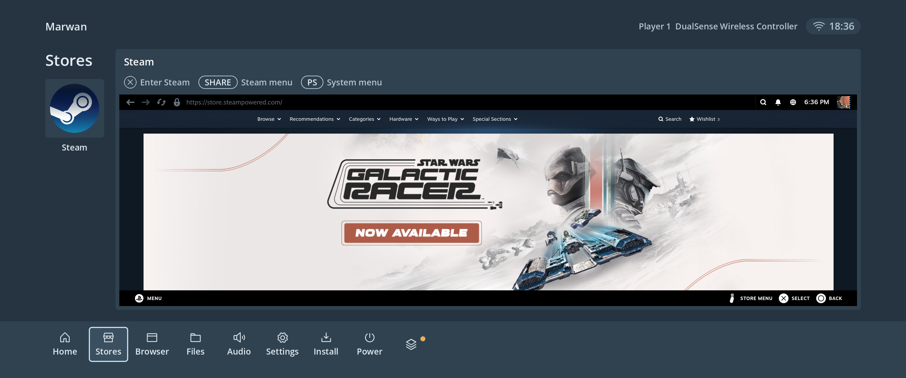

# Console design — PC1 bench, 2026-10-09

The approved blue-grey console design is running on PC1. The layout expands with
the viewport, with a user header, compact artwork tiles, primary and secondary
actions, a PS/Home-controlled bottom dock, and attached right-edge action panels.
Steam runs inside the Stores content area using the existing native integration.

On Home and Stores the dock starts hidden while browsing. PS/Home reveals it
and focuses the current destination; a second press hides it and restores the
originating game, control or embedded Steam pane. Up reaches the Home actions.
Stores expands into the available space whenever the dock is hidden.

The highlighted game's landscape library artwork fills Home in full colour.
Local dark scrims protect the summary and header; the blue-grey canvas returns
when an entry has no artwork. Steam metadata now prefers `library_hero.jpg`
instead of its faint store-page backdrop, and existing cached games migrate once.

Shared rules for future products are in [the design guidelines](design-system.md).
`TvTheme`, `ConsoleButton` and `EdgePanel` provide the common foundations.
The active bench display name is `Marwan`, supplied by the deployment wrapper
until the user-profile flow provides its own value.













## Validation

- Built with pinned Godot 4.7.1; import/export and startup preflight passed without
  script or parse errors.
- Responsive fixture checks passed at 1280×720, 1920×1080, 3840×2160,
  2580×1080 and 900×1080, including overflow, card reuse, status refresh,
  primary/secondary action focus, attached panels and bounded Stores content.
- PS/Home checks passed at all five sizes: initial hidden state, reveal/current
  destination focus, second-press restoration, exclusion of hidden dock controls,
  expanded Stores bounds, native Steam ownership transfer and empty-library
  recovery. Up no longer reveals the dock.
- Metadata page regression checks passed on the bench build.
- All 15 metadata worker tests passed, including library hero selection,
  one-time cache migration and offline retry/cache preservation.
- Real selection changes between Silksong and TEKKEN 8 displayed their own
  landscape art. Selecting Steam, which has no game art, restored the blue-grey
  canvas; the attached Options panel stayed readable over the game background.
- The Browser destination opened and its native engine produced a page; the
  separately developed browser redesign is outside this design acceptance.
- Actual output inspected at 3440×1440. Godot expands its logical canvas to
  2580×1080, preserving square artwork and revealing more horizontal space.
- Software controller pulses through the physical DualSense device and broker
  exercised Options/Back, dock navigation, Stores entry, Guide return and Home
  library selection. This is not a human controller-feel test.
- The PS/Home update was exercised through the physical DualSense broker:
  Guide opened the dock, Guide restored the selected Silksong card, and Stores
  opened with its dock hidden. Guide then transferred input from native Steam
  to the active Stores dock and back. The native helper reported `focus=true`
  and `client_has_focus=true` after restoration. Home was restored after checks.
- Native Steam attached at x=453, y=360, width=2801, height=1022 with the dock
  hidden, shrinking to height=806 while it was open. The user header remains.
- Steam needed a click inside the pane to restore native UI input after
  reattachment; its menu and Store then opened with the mouse. Native Steam
  controller input after reattachment remains an integration issue. This update
  preserves the separately deployed Steam helper rather than replacing it.
- Artwork backgrounds decode on a worker thread with bounded caching, and
  unchanged library cards are reused. Physical frame pacing and input latency
  were not measured.

## Deployment

The standalone bench layer is `/var/marwanos/console-design-20261009/`, enabled by
`marwanos-console-design.service`. It starts after the existing Windows-library
and Steam overrides and preserves their helper and account data. The base image
is `0.0.202610071750` (`a38dce1`). A reboot was not performed; the unit is enabled
for subsequent boots and guards the underlying wrapper checksum.

Exported binary SHA-256:
`684b08cf16c2a7d6f222e236740a241e6d3803769a268077f88c0ab7e7646a98`.

Source archive SHA-256:
`71d67ec6a649258c11598cb3e42a8bb5de7e385e9fce712caa7a08bb52772803`.

The artwork update was built on the exact previous deployed source, replacing
only the home and theme scripts, preserving concurrent browser and Steam work.
The prior design binary remains at
`/var/marwanos/console-design-20261009/marwanos-shell.before-game-art`.

The PS/Home update was applied with exact source-context changes to that
deployed artwork build. Concurrent Downloads, Files and keyboard work in the
shared checkout was preserved and excluded from this bench build. Its source
and test evidence are in `/var/tmp/pc1-ps-dock-20261009/`; the deployment manifest
is `ps-dock-deployment.json` in the bench layer. The artwork build remains at
`/var/marwanos/console-design-20261009/marwanos-shell.before-ps-dock`.

The metadata worker uses a player-owned drop-in at
`/var/home/player/.config/systemd/user/marwanos-metadata.service.d/40-library-art.conf`,
pointing to `metadata_entry.py` in the same bench folder. It selects the updated
worker only while the underlying installed worker matches the expected checksum;
a changed OS worker is used directly. Metadata source archive SHA-256:
`bd64876eb985d5be851d42abf10b380d9d7c25030a8b7900cd852a17c1e0ea2b`.

With games closed, rollback on PC1 is:

```sh
systemctl disable --now marwanos-console-design.service
pkill -TERM -u player -x marwanos-shell
```

The supervisor then restores the underlying Steam-enabled bench shell. The
mount guard refuses to unmount an unrelated later override.

To also remove the metadata artwork override, remove only the above
`40-library-art.conf` file, then reload and restart the player's worker:

```sh
runuser -u player -- env XDG_RUNTIME_DIR=/run/user/1000 systemctl --user daemon-reload
runuser -u player -- env XDG_RUNTIME_DIR=/run/user/1000 systemctl --user restart marwanos-metadata.service
```

Downloaded game artwork and metadata are retained.
