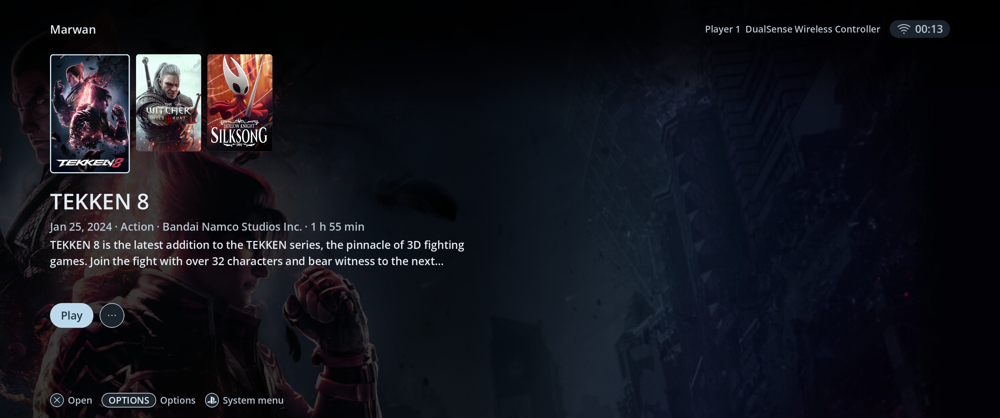
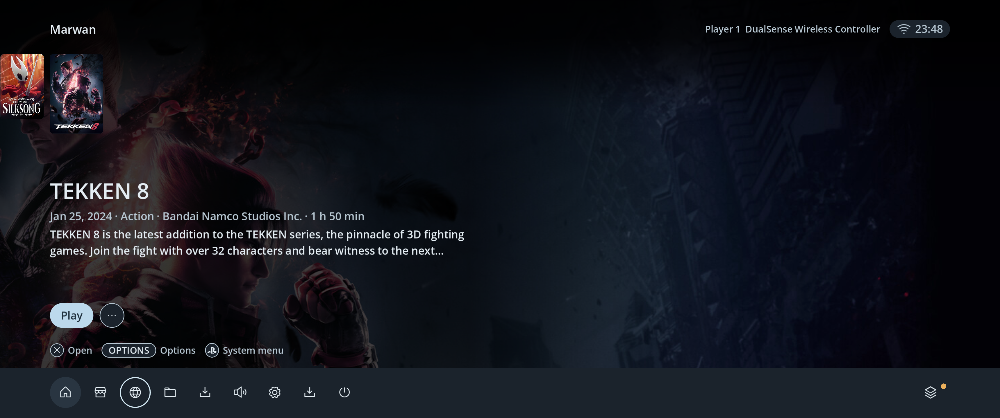
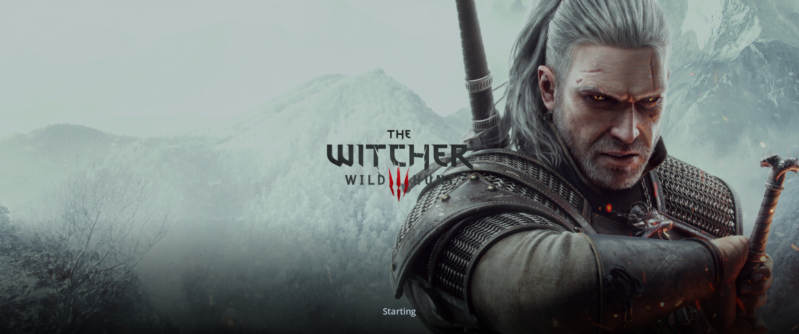
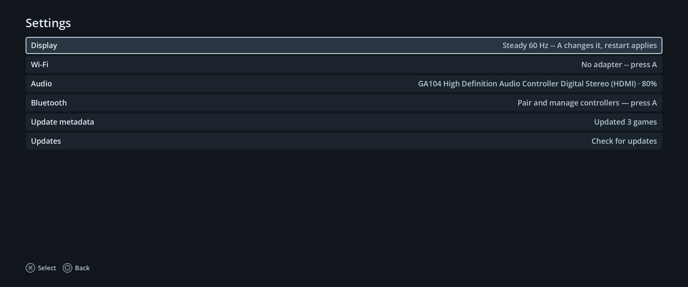
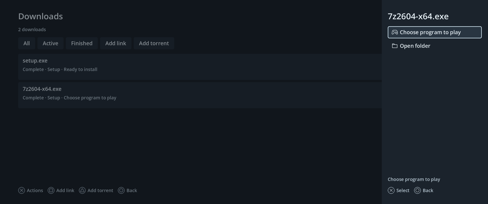
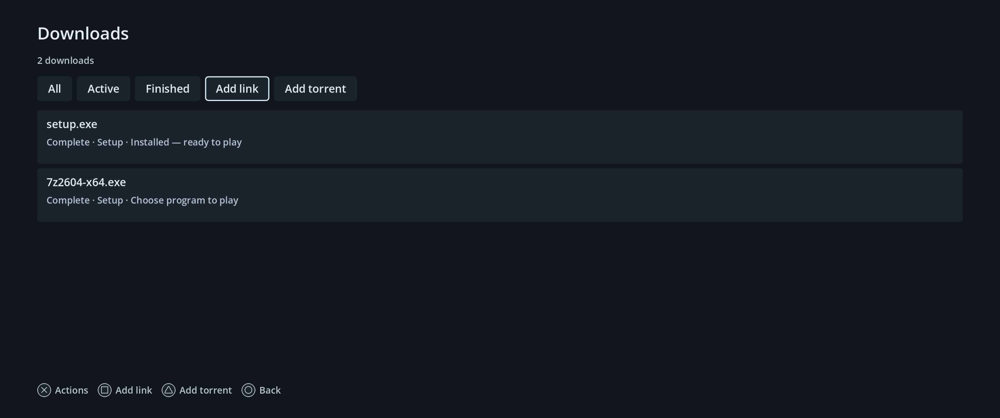

# Console refinements — PC1, 2026-10-10

The PC1 bench at `192.168.50.206` uses the darker console shell with continuous
Home game actions and vertical rounded game cards.

## Behavior

- Home uses 2:3 portrait cards. Cover artwork fills the card and clips to its
  rounded corners; the focus outline remains above the image.
- Selected and unselected cards are 50% larger in both dimensions. The rail
  reserves their full height; wrapped overview text keeps Play/Options below it.
- Down focuses Play beneath the selected game while retaining its artwork,
  overview and rail. Back restores the selected card.
- Home omits the Game actions tutorial hint. System menu uses the PlayStation
  controller mark rather than the letters PS.
- Launching games show their cached background and logo until the existing
  window watchdog confirms the game is on screen. Missing artwork falls back
  to the title and application icon; hung launches retain controller recovery.
- Play and Options sit 3u lower than the initial refinement, approximately
  32 logical pixels at 1080p. Their baseline is retained with the larger cards;
  narrow layouts move them down as needed to clear wrapped game details.
- Play has semicircular ends. Options is an outlined circular three-dot button;
  system-menu icon selection is circular, and Browser uses a globe glyph.
- System-menu circles are 80 logical pixels around unchanged 36-pixel icons.
  The slimmer 12u bar keeps the badged activity indicator pinned to its right
  edge while the main destinations scroll independently on narrow displays.
- Steam is reached through Stores. Download utilities, unfinished transfers
  and unfinished setup are excluded from Home.
- Downloads retains setup receipts and unfinished program selection. Finished
  items expose Install, Choose program to play or Play according to setup state.
  Back from program selection restores the originating Downloads item.
- Settings → Update metadata refreshes every installed game, with progress,
  completion and failure feedback. Manual matches and title overrides survive.
- The Witcher 3 installation was matched to Steam Store game `292030` and its
  cover, background, header and logo were imported successfully. The live bulk
  update completed for all three games with no failures.
- Shared menus and Settings use charcoal surfaces. The concurrent keyboard
  input and icon-only system-menu updates are preserved.

## Verification

Seven focused Godot suites passed: responsive design, Downloads, console
refinements, metadata page, Windows setup, Home metadata and keyboard timing.
The responsive suite covers 720p, 1080p, 4K, ultrawide and a narrow window.
Metadata (18), download handoff (8) and native download engine (11) Python
checks passed, including real local transfer pause/resume and content checks.

The exported Linux shell passed a separate startup check as the session user.
The hint/splash follow-up reran responsive design and Windows launch/recovery
checks plus exported startup and metadata preflight. Isolated native rendering
verified all three games' background/logo splashes, missing-art fallback and
narrow-window failure feedback. Live Home verified the removed tutorial and
PlayStation mark; the game handoff lifecycle remains unchanged.
The 50% card-size follow-up reran the responsive suite with populated game
details and checked rendered ultrawide, 1080p and narrow layouts. The export
also passed startup and metadata preflight as the player user.
Live controller events through the connected DualSense/broker verified Home
Down/Back, Settings and finished-download actions. Screenshots were inspected
on the actual 3440×1440 display. These software checks do not replace the
owner's assessment of controller feel or sofa readability.

## Deployment and recovery

The active shell is `/var/marwanos/console-design-20261009/marwanos-shell`.
Its manifest is `refinement-deployment-20261010.json` in the same directory,
including binary and source hashes. The matching source snapshot is
`/var/tmp/pc1-larger-cards-20261010/validated-source.tar.gz`.

Final shell SHA-256:
`214c969ba0ad93e1814e76d25315fb9c8f73b5fb48240c89e309858d27076f12`.

The metadata worker and native Downloads user service are active. Downloads
uses a private Fedora aria2 runtime in the existing bench layer. No OS image
was rebuilt and no reboot was performed.

The original pre-refinement shell is saved as
`marwanos-shell.before-refinement-20261010`; the alignment rollback is
`marwanos-shell.before-dock-alignment-20261010`, and the hint/splash rollback is
`marwanos-shell.before-game-splash-20261010`. The larger-card rollback is
`marwanos-shell.before-larger-cards-20261010`. The latest Files controls,
browser extension implementation and native engine are preserved. Restore a chosen binary only
after games/installers are closed, then restart the supervised shell. Worker
backups are stored beside the bench metadata worker and Windows download helper.
