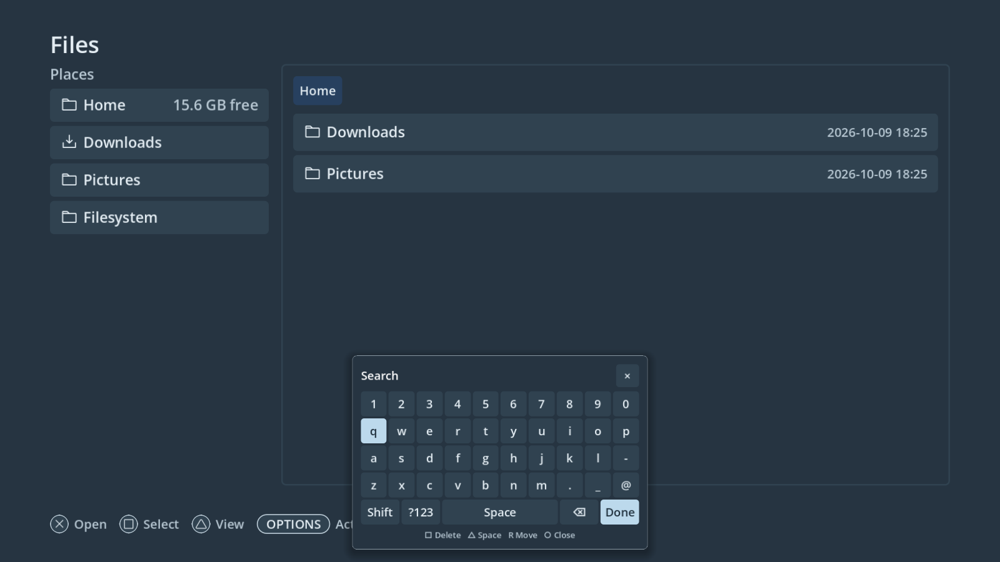

# Floating keyboard — 2026-10-09

The shared keyboard is a compact panel with four character rows, a symbols
toggle and a short action row. It opens near the bottom centre, moves by header
drag or right stick, and remembers its position. Number inputs use a narrower
pad. Live editors keep their text in the original field; shell drafts still
commit only on Done.

Browser fields open it automatically after pointer release. The document keeps
its full size and scrolls covered editors into view. Native accessible editors
use a separate unfocusable window, with AT-SPI focus metadata and guarded XTEST
edits. Controller navigation consumes each event once, and closing the panel
restores application input. Clicking the same field reopens it.

Steam starts with its CEF accessibility bridge enabled. Custom application
controls without accessible editors retain the Home → Type fallback.

## Verification

- Godot tools, keyboard, browser and browser extension shell checks passed.
  Keyboard layout was checked at 1280×720, 900×720 and 400×600.
- The C++ extension compiled against pinned Godot 4.7.1 and CEF 151. Real
  Chromium field editing, passwords, email/Next, numeric input and Search
  checks completed with zero failures.
- Ten Python focus guard tests passed, including stale targets, literal text,
  private requests, pointer release and reopening.
- Ten isolated Linux native checks passed using real GTK fields, AT-SPI,
  XInput 2.1, XTEST and Godot: automatic opening, mouse/controller typing,
  field switching, passwords, Done, reopening and read-only rejection. No
  Godot errors were reported.
- Native and Flatpak Steam command tests passed. The accessibility flag was
  found in the installed Steam binary; live Steam UI and gamescope composition
  still require an installation check.

PC1 checks ran in `/var/tmp/marwanos-floating-keyboard-20261009` with private
profiles and Xvfb/session buses. Its live installation was not updated or
restarted. The rendered preview uses a fixture filesystem.
