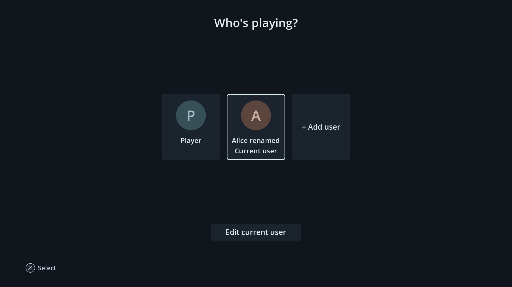
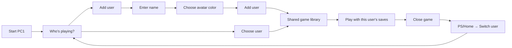

# Console users

PC1 now opens **Who's playing?** at startup. Choose a user to enter the shared
library, or choose **Add user**, enter a name with the controller keyboard,
choose an avatar color, and select **Add user**. The new user becomes active.
Up to eight local users are supported. The original user can be renamed with
**Edit current user**; existing saves remain with that original user.

After startup, press PS/Home and choose **Switch user**, or open
**Settings → Users**. Close games and apps, including minimized ones, and finish
installation before switching. The picker explains any blocker. Back cancels
adding a user or returns to the library from Switch user; startup requires a
selection. New users have permanent IDs, so renaming never changes save ownership.





## Shared and personal data

| Shared across users | Personal to each user |
|---|---|
| Installed games, application binaries and artwork | Standard Windows/Proton user save folders and user registry |
| Common library and download/install queue | Steam userdata, including local remote-save files |
| Operating system and device settings | HOME/XDG directories for shell-launched native games and native Steam games |
| The Linux `player` account | Play history, recent-game ordering and achievement cache |
| Chromium website sign-ins and cookies | Browser bookmarks and browsing-history list |

Users live in `~/.local/share/marwanos/profiles/users.json`. Personal data lives
under `profiles/<permanent-id>/`. The original user's shell history, achievement
cache and browser library retain their legacy paths. The old `profile-name`
becomes the original user's display name on first migration.

`profiles.py` redirects managed Wine/Proton `drive_c/users`, `user.reg` and Steam
`userdata` into personal storage. Existing data is moved into the original user's
store, never copied into new users. New Steam prefixes created while another
user is active belong to that user. Game binaries stay in place. A persistent
binding record accounts for Wine replacing `user.reg` during registry commits.
Interrupted migrations can be retried, and unexpected links or conflicting
legacy/archive files cause an error instead of being overwritten.

Switching stops embedded/background Steam, verifies the client exited, rebinds
save locations, then atomically commits the selected user. A failed commit
restores the previous bindings. Achievement polling shares the save-switch lock
and checks the selected user before reading progress. Browser tabs close on a
switch; each user's bookmarks/history reload when Browser opens again.

## Compatibility limits

- Steam Cloud follows the Steam account. Separate local profiles using one
  Steam account must disable Cloud for affected games, or use separate Steam
  accounts. Sharing an installation does
  not grant another account a game license or bypass DRM.
- The local profile integration targets native Steam. The legacy Flatpak
  fallback remains available to the original user; other profiles need native
  Steam.
- Games saving beside their executable, in shared ProgramData, or in other
  custom paths need game-specific handling. Those locations currently remain
  shared; Add user explains this limit. Games installed inside `drive_c/users`
  must be reinstalled into `C:\Games` to share their binaries with another user.
- Local profiles share a Linux uid. They separate supported game data, but are
  not protected OS accounts. Files, browser website sessions and machine settings
  remain shared. No PIN or parental controls are included.
- Removing an app removes its common installation for everyone. Profile save
  archives remain in storage; reinstalling to a different prefix does not
  automatically reconnect those archives.

## Verification

On 2026-10-10, 14 Linux profile regressions pass, including two users launching
the same executable through the real managed-app helper, registry replacement,
legacy-save preservation, external Steam libraries, invalid paths, migration
recovery and failed-switch rollback. Three Steam and 28 achievement backend
regressions also pass. The existing local-installer suite passes 32/36 tests in
the isolated WSL runtime; four guided-display tests fail because `Xvfb` is absent.

Godot 4.7.1 passes the profile, shared Home design, play-history, achievements,
console-refinement and browser-shell suites. Profile checks cover adding,
renaming, persistent selection, separate history, minimized-game blocking,
keyboard cancellation, Settings navigation and layouts at 900, 1920 and 2580 px.
The picker is rendered and inspected on Windows. This is source/fixture
validation; native Steam, real Proton registry behavior and save/restore across
two users still need acceptance with actual games on PC1. No OS image or target
deployment was produced by this change.

```bash
python3 -m unittest discover -s tests -p test_profiles.py -v
GODOT_BIN=/path/to/godot bash scripts/check-profiles-shell.sh
```

Windows shell verification and screenshot capture:

```powershell
./scripts/check-profiles-local.ps1 -Capture -GodotBin /path/to/Godot_v4.7.1-stable_win64_console.exe
```

Fixture overrides are `MARWANOS_PROFILES_HOME`, `MARWANOS_HISTORY_HOME` and
`MARWANOS_ACHIEVEMENTS_HOME`. `MARWANOS_SHELL_WINDOWED` suppresses the startup
picker for development and existing headless suites. `MARWANOS_PROFILE_ID`
passes the selected permanent user ID to game helpers.
